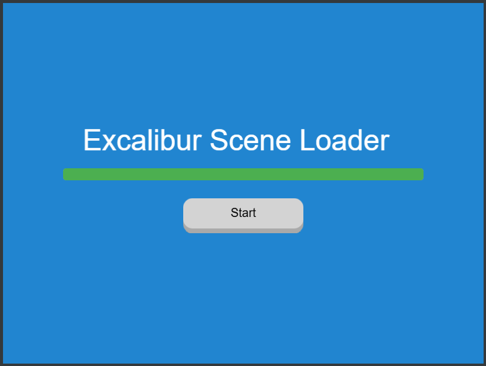

# DefaultSceneLoader

A custom Excalibur scene loader that manages asynchronous resource loading with progress tracking, event emission, and automatic sound
engine wiring.



## Overview

`DefaultSceneLoader` extends Excalibur's `Scene` class to provide a flexible resource loading system. It handles loading multiple
resources concurrently, tracks progress, emits lifecycle events, and manages audio context initialization.

## Installation

Import the `DefaultSceneLoader` class into your project:

```typescript
import { DefaultSceneLoader } from "./DefaultSceneLoader";
```

## Basic Usage

### Creating a Loader

Initialize the loader by passing an object containing your Excalibur resources:

```typescript
import { DefaultSceneLoader } from "./DefaultSceneLoader";
import { ImageSource, Sound, Engine } from "excalibur";

//load resources...
const Resources = {
  playerImage: new ImageSource("./assets/player.png"),
  backgroundImage: new ImageSource("./assets/background.png"),
  bgm: new Sound("./assets/music.mp3"),
  sfx: new Sound("./assets/effect.wav"),
};

// create Custom Loader
class MyCustomLoader extends DefaultSceneLoader {
  constructor(resources: any) {
    super(resources);
  }

  onInitialize(engine: Engine): void {
    // add decorative Actors and ScreenElements
  }

  showPlayButton(): Promise<void> {
    //this gets called when all resources are loaded
    return new Promise(resolve => {
      // show button here
      // this.add(mybutton)     ---> Button event should call engine.goTo('main');
      resolve();
    });
  }

  onPreUpdate(engine: Engine, elapsed: number): void {
    //update any progress bar here
    //this.myProgressBar.value = ....
  }
}

const game = new Engine({
  width: 800, // the width of the canvas
  height: 600, // the height of the canvas
  displayMode: DisplayMode.Fixed, // the display mode
  pixelArt: true,
  scenes: {
    loader: new Loader(Resources), // you can also pass a list of resources to load here
    main: new Main(), // main or 'first' game scene
  },
});

await game.start();
game.goToScene("loader");
```

## Key Features

### Automatic Resource Loading

Resources are loaded automatically when the loader scene is created. The constructor calls `load()` internally.

### Concurrent Loading

Multiple resources load in parallel for optimal performance:

```typescript
// All resources load concurrently, not sequentially
const loader = new DefaultSceneLoader({
  image1: new ImageSource("./a.png"),
  image2: new ImageSource("./b.png"),
  sound1: new Sound("./c.mp3"),
  // All three load at the same time
});
```

#### Progress Tracking

    OnPreUpdate method can be used to update status of loads

#### Sound Engine Wiring

    Sounds are automatically wired to the Excalibur engine:

#### AudioContext Unlock

    Handles browser AudioContext initialization after user interaction:

## Events

The loader emits events throughout its lifecycle:

- **`beforeload`** - Emitted before loading starts
- **`loadresourcestart`** - Emitted when a resource begins loading
- **`loadresourceend`** - Emitted when a resource finishes loading
- **`useraction`** - Emitted after user interaction
- **`afterload`** - Emitted after all loading is complete

## Lifecycle Hooks

Override these methods to customize loader behavior:

### `onBeforeLoad()`

Called before resource loading begins. Override to perform setup:

```typescript
class CustomLoader extends DefaultSceneLoader {
  async onBeforeLoad() {
    console.log("Preparing to load...");
    // Custom setup code
  }
}
```

### `onUserAction()`

Called after all resources load and waits for user interaction. Override to show UI:

```typescript
class CustomLoader extends DefaultSceneLoader {
  async onUserAction() {
    await super.onUserAction();
    // Custom user interaction handling
    // Show "Press to Continue" button, etc.
  }
}
```

### `showPlayButton()`

Override to display play button UI:

```typescript
class CustomLoader extends DefaultSceneLoader {
  showPlayButton() {
    return new Promise(resolve => {
      // Show UI button
      document.getElementById("playButton").style.display = "block";

      // Resolve when player clicks
      document.getElementById("playButton").onclick = () => {
        document.getElementById("playButton").style.display = "none";
        resolve();
      };
    });
  }
}
```

### `onAfterLoad()`

Called after user action. Use for cleanup or final setup:

```typescript
class CustomLoader extends DefaultSceneLoader {
  async onAfterLoad() {
    console.log("All loading complete, transitioning to game...");
    // Perform cleanup
    // Could transition to game scene here
  }
}
```

### `dispose()`

Override to clean up resources:

```typescript
class CustomLoader extends DefaultSceneLoader {
  dispose() {
    // Cleanup code
    console.log("Cleaning up loader...");
  }
}
```

## API Reference

### Constructor

```typescript
constructor(resources: any)
```

Creates a new loader with the given resources object.

### Properties

- `_resources: Loadable<any>[]` - Array of resources being loaded
- `_isLoading: boolean` - Whether loading is currently in progress
- `_loaded: boolean` - Whether all resources are loaded
- `_numLoaded: number` - Count of resources that have finished loading
- `data: Loadable<any>[]` - Loaded resources data

### Methods

- `load(): Promise<Loadable<any>[]>` - Begin loading resources
- `isLoaded(): boolean` - Check if all resources are loaded
- `addResource(loadable: Loadable): void` - Add a resource after initialization
- `onBeforeLoad(): Promise<void>` - Hook called before loading starts
- `onUserAction(): Promise<void>` - Hook called after resources load
- `showPlayButton(): Promise<void>` - Show play button UI
- `onAfterLoad(): Promise<void>` - Hook called after user action
- `dispose(): void` - Cleanup method

## Notes

- Resources are only loaded once. Subsequent calls to `load()` return the cached resources
- The loader respects Excalibur's `Loadable` interface for all resources
- Sound wiring is automatic for all `Sound` instances in the resources
