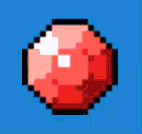

# Gleam Material for ExcaliburJS

A custom GLSL shader material that adds an animated white glint effect to sprites in ExcaliburJS. Perfect for creating shiny gems,
metallic surfaces, or any object that needs that extra sparkle.



## Features

- **Diagonal traveling glint** - A bright white band that sweeps across your sprite
- **Trigger-based animation** - Full control over when glints appear
- **Configurable speed** - Adjust how fast the glint travels
- **Alpha-aware** - Only renders glint on non-transparent pixels
- **Zero dependencies** - Works with vanilla ExcaliburJS

## Installation

1. Copy `gleamMaterial.ts` into your project
2. Import and use in your Actor classes

## Basic Usage

```typescript
import { Actor, Engine, Shader } from "excalibur";
import { createGleamMaterial } from "./gleamMaterial";

class MyShinyActor extends Actor {
  private lastGlintTime = 0;
  private glintInterval = 5000; // Glint every 5 seconds

  constructor() {
    super({
      x: 100,
      y: 100,
      width: 48,
      height: 48,
    });
  }

  onInitialize(engine: Engine): void {
    // Set up your sprite first
    const sprite = Resources.MyImage.toSprite();
    this.graphics.use(sprite);

    // Apply the gleam material
    this.graphics.material = createGleamMaterial(engine);

    // Configure glint parameters
    this.graphics.material?.update((s: Shader) => {
      s.trySetUniformFloat("u_glint_speed", 1.0); // Normal speed
      s.trySetUniformFloat("u_glint_trigger", -999.0); // No glint initially
    });
  }

  onPreUpdate(engine: Engine): void {
    const currentTime = engine.clock.now();

    // Automatically trigger glints at intervals
    if (currentTime - this.lastGlintTime > this.glintInterval) {
      this.lastGlintTime = currentTime;

      this.graphics.material?.update((s: Shader) => {
        s.trySetUniformFloat("u_glint_trigger", currentTime / 1000.0);
      });
    }
  }
}
```

## Shader Uniforms

### `u_glint_speed` (float)

Controls how fast the glint travels across the sprite.

- `0.5` - Slow, smooth sweep
- `1.0` - Normal speed (default)
- `2.0` - Fast sweep
- `3.0+` - Very fast

**Note:** The glint takes 2 seconds to complete at speed `1.0`.

### `u_glint_trigger` (float)

The timestamp (in seconds) when the glint should start.

- Set to `-999.0` or any negative value to hide the glint
- Set to `currentTime / 1000.0` to trigger a new glint
- The glint plays for 2 seconds after being triggered

## Advanced Usage

### Manual Triggering

You can trigger glints manually in response to game events:

```typescript
class MyActor extends Actor {
  onInitialize(engine: Engine): void {
    this.graphics.material = createGleamMaterial(engine);

    this.graphics.material?.update((s: Shader) => {
      s.trySetUniformFloat("u_glint_speed", 1.5);
      s.trySetUniformFloat("u_glint_trigger", -999.0);
    });
  }

  // Trigger glint on collision, pickup, etc.
  public triggerGlint(engine: Engine): void {
    const currentTime = engine.clock.now();
    this.graphics.material?.update((s: Shader) => {
      s.trySetUniformFloat("u_glint_trigger", currentTime / 1000.0);
    });
  }

  onCollisionStart(): void {
    this.triggerGlint(this.scene.engine);
  }
}
```

### Random Intervals

Create more natural-looking glints with randomized timing:

```typescript
class RandomGleamActor extends Actor {
  private lastGlintTime = 0;
  private glintInterval = 0;

  onInitialize(engine: Engine): void {
    this.graphics.material = createGleamMaterial(engine);
    this.graphics.material?.update((s: Shader) => {
      s.trySetUniformFloat("u_glint_speed", 1.0);
      s.trySetUniformFloat("u_glint_trigger", -999.0);
    });

    this.scheduleNextGlint();
  }

  private scheduleNextGlint(): void {
    // Random interval between 3-8 seconds
    this.glintInterval = 3000 + Math.random() * 5000;
  }

  onPreUpdate(engine: Engine): void {
    const currentTime = engine.clock.now();

    if (currentTime - this.lastGlintTime > this.glintInterval) {
      this.lastGlintTime = currentTime;

      this.graphics.material?.update((s: Shader) => {
        s.trySetUniformFloat("u_glint_trigger", currentTime / 1000.0);
      });

      this.scheduleNextGlint();
    }
  }
}
```

### One-Shot Glint (No Repeating)

For a single glint effect that doesn't repeat:

```typescript
class OneTimeGleamActor extends Actor {
  private hasGlinted = false;

  onInitialize(engine: Engine): void {
    this.graphics.material = createGleamMaterial(engine);
    this.graphics.material?.update((s: Shader) => {
      s.trySetUniformFloat("u_glint_speed", 2.0);
      s.trySetUniformFloat("u_glint_trigger", -999.0);
    });

    // Trigger once after 1 second
    setTimeout(() => {
      if (!this.hasGlinted) {
        this.triggerGlint(engine);
        this.hasGlinted = true;
      }
    }, 1000);
  }

  public triggerGlint(engine: Engine): void {
    const currentTime = engine.clock.now();
    this.graphics.material?.update((s: Shader) => {
      s.trySetUniformFloat("u_glint_trigger", currentTime / 1000.0);
    });
  }
}
```

## Customization

You can modify the shader constants in `gleamMaterial.ts`:

```glsl
// In the shader main() function:
float glintDuration = 2.0;    // How long the glint animation lasts
float glintWidth = 0.15;      // Width of the glint band (0.1 = narrow, 0.3 = wide)
vec3(glint * 0.8)             // Brightness of the glint (0.5 = dim, 1.0 = bright)
```

### Adjust Glint Direction

The glint travels diagonally by default. To change the direction, modify this line:

```glsl
// Current: diagonal from bottom-left to top-right
float diagonal = (v_uv.x + v_uv.y) * 0.5;

// Horizontal (left to right):
float diagonal = v_uv.x;

// Vertical (bottom to top):
float diagonal = v_uv.y;

// Different diagonal (top-left to bottom-right):
float diagonal = (v_uv.x + (1.0 - v_uv.y)) * 0.5;
```

## Performance Notes

- The shader only renders glint on opaque pixels (alpha > 0)
- Glint calculations only occur during the 2-second animation window
- No performance impact when glint is not active
- Safe to use on multiple actors simultaneously

## License

MIT - Free to use and modify for your ExcaliburJS projects.

## Credits

Created for ExcaliburJS users
