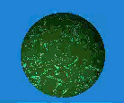

# Marble Shader



A procedural marble texture shader written in GLSL for use in game development with Excalibur.js. This shader generates realistic
marble patterns with swirling veins, lighting effects, and customizable parameters.

## Description

The marble shader creates organic marble textures using fractal Brownian motion (FBM), domain warping, and layered noise functions. It
simulates the natural swirling patterns found in real marble by warping the texture coordinates and generating vein systems. The shader
includes dynamic lighting with normal mapping and supports animation through time-based rotation.

## Features

- **Procedural Marble Texture** - Generates unique marble patterns using noise functions
- **Domain Warping** - Creates complex swirling patterns through coordinate warping
- **Dual Vein Systems** - Two overlapping vein patterns for realistic marble appearance
- **Dynamic Lighting** - Sphere-based normal mapping with configurable light direction
- **Seed-Based Variation** - Different seeds produce unique marble patterns
- **Time-Based Animation** - Optional rotation animation for dynamic effects
- **Customizable Colors** - Separate base and vein colors
- **Scale Control** - Adjustable pattern scale for different marble types

## Usage

1. Import the shader:

```typescript
import { marbleShader } from "./marble.ts";
```

2. Create a material in your Excalibur.js game:

```typescript
onInitialize(engine: Engine): void {
  this.material = engine.graphicsContext.createMaterial({
    name: "marble",
    fragmentSource: marbleShader,
    color: Color.Red, // Base color (light beige)
    uniforms: {
      u_scale: 6.0,
      u_seed: 42.0,
      u_veinColor: [0.3, 0.2, 0.1, 1.0],    // Vein color (dark brown)
      u_angle:0.0,                          // Rotation angle in radians
    },
  });

  this.graphics.material = this.material;
}
```

3. For animated rotation, update the angle in your update loop:

```typescript
onPostUpdate(engine: Engine): void {
    const angle = engine.clock.elapsed() * 0.001 * this.speedPercent * MAX_ROTATE_SPEED;
    this.material.update((s: Shader) => {
      s.trySetUniformFloat("u_angle", this.accumulatedAngle);
    });
}
```

## Uniform Parameters

| Uniform       | Type  | Description                                | Default/Range       |
| ------------- | ----- | ------------------------------------------ | ------------------- | ----------------------- |
| `u_scale`     | float | Controls the size of marble patterns       | 1.0-20.0            |
| `u_seed`      | float | Random seed for generating unique patterns | Any float           |
| `u_color`     | vec4  | Base color of the marble                   | RGBA values 0.0-1.0 | //provided by Excalibur |
| `u_veinColor` | vec4  | Color of the marble veins                  | RGBA values 0.0-1.0 |
| `u_angle`     | float | Rotation angle in radians                  | 0.0-6.28 (2π)       |
| `u_time_ms`   | float | Time in milliseconds (legacy, use u_angle) | 0.0+                | //provided by Excalibur |

## How It Works

The shader uses several techniques to create realistic marble:

1. **Noise Generation**: Implements Perlin-like noise using hash functions
2. **Fractal Brownian Motion**: Layers multiple octaves of noise for organic structure
3. **Domain Warping**: Warps texture coordinates using noise to create swirling patterns
4. **Vein Generation**: Creates vein patterns using sine waves modulated by turbulence
5. **Lighting**: Calculates sphere normals for realistic 3D lighting effects

The shader discards pixels outside a 0.5 radius circle, making it suitable for spherical or circular marble objects.
