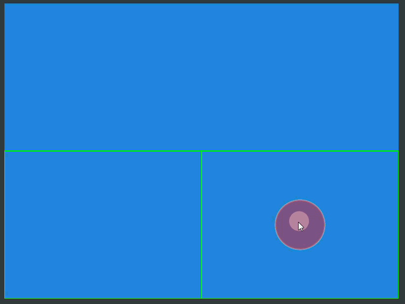

# VirtualJoystick

A production-ready virtual joystick module for ExcaliburJS games. Provides smooth, responsive touch input with support for
floating/fixed positioning, multitouch, directional snapping, and customizable visuals.



## Features

- **Dual Modes**: Floating (spawns at touch) or fixed (stationary base) joysticks
- **Multitouch Support**: Handles multiple simultaneous touches
- **Directional Snapping**: 4-way or 8-way cardinal directions
- **Deadzone**: Configurable inner deadzone for precision control
- **Custom Rendering**: Optional custom draw callback for full visual control
- **Event System**: Emits start, move, and end events
- **Clean API**: Simple polling interface with vector/magnitude/angle outputs

## Installation

This module is part of your ExcaliburJS project. Import it directly:

```typescript
import { VirtualJoystick, JoystickMode, SnapMode, SnapStrength } from "./Virtualjoystick";
```

## Quick Start

```typescript
import { Engine, ScreenElement, Vector, Color } from "excalibur";
import { VirtualJoystick } from "./Lib/Virtualjoystick";

const engine = new Engine();

// Create a region for the joystick (full screen in this example)
const region = new ScreenElement({
  x: 0,
  y: 0,
  width: engine.drawWidth,
  height: engine.drawHeight,
  color: Color.Transparent, // enables ScreenElement Graphic to capture pointer events
});

engine.add(region);

// Create a floating joystick
const joystick = new VirtualJoystick({
  mode: JoystickMode.Floating,
  region: region,
  maxRadius: 60,
  deadZoneRadius: 10,
  color: Color.White,
});

engine.add(joystick);

// Poll in your game loop
engine.on("postupdate", () => {
  const input = joystick.getVector();
  // input.x and input.y are in range [-1, 1]
  player.move(input.x * speed, input.y * speed);
});

engine.start();
```

## Configuration

The `VirtualJoystickConfig` interface defines all available options:

```typescript
interface VirtualJoystickConfig {
  /** JoystickMode.Floating – base spawns at touch; JoystickMode.Fixed – base stays put */
  mode: JoystickMode;

  /** The ScreenElement whose bounds define the active touch region */
  region: ScreenElement;

  // Movement
  maxRadius: number;
  deadZoneRadius: number;

  // Snapping
  snapMode?: SnapMode; // SnapMode.None | SnapMode.FourWay | SnapMode.EightWay
  snapStrength?: SnapStrength; // SnapStrength.Preserve | SnapStrength.Full

  // Fixed-mode only
  basePosition?: Vector;
  activationRadius?: number;

  // Visuals
  baseRadius?: number;
  handleRadius?: number;
  color?: Color;
  opacity?: number;

  // Behaviour
  recenterOnRelease?: boolean;

  // Custom rendering
  customDraw?: (ctx: CanvasRenderingContext2D, state: JoystickDrawState) => void;
}
```

### Key Options

- **`mode`**: Choose `JoystickMode.Floating` for joysticks that appear where touched, or `JoystickMode.Fixed` for stationary joysticks
- **`maxRadius`**: Maximum distance the handle can move from center (affects sensitivity)
- **`deadZoneRadius`**: Inner circle where input is ignored (prevents drift)
- **`snapMode`**: Force directions to cardinal angles (`SnapMode.FourWay`: up/down/left/right, `SnapMode.EightWay`: includes diagonals)
- **`snapStrength`**: `SnapStrength.Preserve` maintains original magnitude, `SnapStrength.Full` snaps to maximum
- **`basePosition`** (fixed mode): Where the joystick base is positioned
- **`activationRadius`** (fixed mode): How far from base you can start dragging
- **`customDraw`**: Provide your own rendering function for complete visual customization

## Constants

The module exports constants for type-safe configuration:

```typescript
// Joystick modes
JoystickMode.Floating; // "floating"
JoystickMode.Fixed; // "fixed"

// Snapping modes
SnapMode.None; // "none"
SnapMode.FourWay; // "4-way"
SnapMode.EightWay; // "8-way"

// Snap strength
SnapStrength.Preserve; // "preserve"
SnapStrength.Full; // "full"

// States (for getState())
JoystickState.Idle; // "idle"
JoystickState.Engaged; // "engaged"
JoystickState.Dragging; // "dragging"
JoystickState.Released; // "released"
```

## API Reference

### Methods

- **`getVector(): Vector`** - Returns normalized vector `[-1, 1]` on each axis
- **`getMagnitude(): number`** - Returns scalar magnitude `[0, 1]`
- **`getAngle(): number`** - Returns angle in radians (0 = right, clockwise positive)
- **`getState(): JoystickState`** - Returns current state: `JoystickState.Idle`, `JoystickState.Engaged`, `JoystickState.Dragging`, or
  `JoystickState.Released`

### Events

Listen to joystick events using the `joyStickEvents` emitter:

```typescript
joystick.joyStickEvents.on("joystickstart", (data: JoystickEventData) => {
  console.log("Joystick engaged");
});

joystick.joyStickEvents.on("joystickmove", (data: JoystickEventData) => {
  // data.vector, data.magnitude, data.angle
});

joystick.joyStickEvents.on("joystickend", (data: JoystickEventData) => {
  console.log("Joystick released");
});
```

Where `JoystickEventData` contains:

- `vector: Vector` - Current normalized vector
- `magnitude: number` - Current magnitude [0, 1]
- `angle: number` - Current angle in radians

## Advanced Usage

### Fixed Joystick

```typescript
const fixedJoystick = new VirtualJoystick({
  mode: JoystickMode.Fixed,
  region: region,
  basePosition: new Vector(100, 300), // Bottom-left position
  activationRadius: 80, // Touch must start near the base
  maxRadius: 50,
  deadZoneRadius: 8,
  color: Color.Red,
});
```

### Custom Rendering

```typescript
const customJoystick = new VirtualJoystick({
  mode: JoystickMode.Floating,
  region: region,
  maxRadius: 60,
  customDraw: (ctx, state) => {
    // Draw your own joystick visuals
    ctx.fillStyle = state.active ? "rgba(0,255,0,0.8)" : "rgba(255,0,0,0.5)";
    ctx.beginPath();
    ctx.arc(state.basePos.x, state.basePos.y, state.baseRadius, 0, Math.PI * 2);
    ctx.fill();

    // Handle
    ctx.fillStyle = "white";
    ctx.beginPath();
    ctx.arc(state.handlePos.x, state.handlePos.y, state.handleRadius, 0, Math.PI * 2);
    ctx.fill();
  },
});
```

### Multiple Joysticks

```typescript
// Left half for movement
const leftRegion = new ScreenElement({ x: 0, y: 0, width: width / 2, height: height });
const moveStick = new VirtualJoystick({
  mode: JoystickMode.Floating,
  region: leftRegion,
  snapMode: SnapMode.EightWay,
  color: Color.Blue,
});

// Right half for camera/looking
const rightRegion = new ScreenElement({ x: width / 2, y: 0, width: width / 2, height: height });
const lookStick = new VirtualJoystick({
  mode: JoystickMode.Fixed,
  region: rightRegion,
  basePosition: new Vector(width * 0.75, height * 0.75),
  color: Color.Green,
});
```

## Tips

- **Performance**: The joystick only renders when active or in fixed mode
- **Multitouch**: Each joystick captures one pointer; multiple joysticks can be active simultaneously
- **Screen Space**: All positions are in screen coordinates
- **Z-Index**: Joysticks render at z=999 by default; adjust as needed
- **Regions**: Use ScreenElements to define touchable areas and layering

## License

This module is provided as-is for use in ExcaliburJS projects.</content>
<parameter name="filePath">c:\programming\virtualJoystick\src\Lib\README.md
