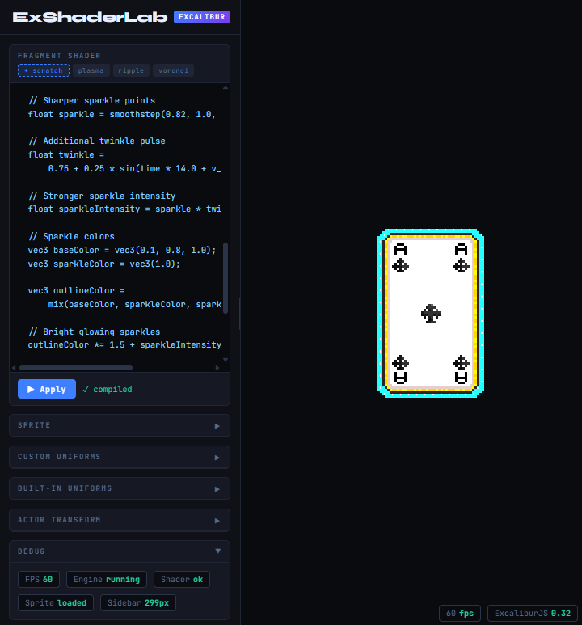

# ExShaderLab

A modern, browser-based shader editor and playground built with **React**, **Excalibur**, and **WebGL2**. Write, test, and visualize
GLSL fragment shaders in real-time with a beautiful dark-themed interface.



## Features

### 🎨 Shader Editing

- **Real-time compilation** with instant visual feedback
- **Multiple shader presets** to get you started:
  - **Scratch** — Empty template for custom shaders
  - **Plasma** — Animated color waves
  - **Ripple** — Wave propagation effect
  - **Voronoi** — Procedural cell pattern generation
- **Tab-based organization** for managing multiple shader experiments
- **Live error reporting** with helpful GLSL compilation feedback

### 🎛️ Uniform Control System

- **Automatic uniform detection** from shader source code
- **Interactive controls** for all uniform types:
  - `float` and `int` — Number inputs and sliders
  - `bool` — Toggle switches
  - `vec2`, `vec3`, `vec4` — Multi-component inputs
- **Type-safe input validation** with proper formatting
- **Range sliders** with live value display

### 🖼️ Asset Management

- **Sprite/texture loading** — Drag & drop or file upload
- **Live texture preview** with dimensions display
- **Texture binding** to `u_graphic` uniform
- **Support for common formats** — PNG, JPG, etc.

### ⚡ Performance Monitoring

- **Real-time debug stats** — FPS and performance metrics
- **Canvas resolution display**
- **Bottom-right stats panel** for quick performance checks

### 🎯 Built-in Uniforms

All shaders have access to these system uniforms:

- `u_time_ms` — Elapsed time in milliseconds
- `u_resolution` — Canvas resolution in pixels
- `u_graphic_resolution` — Texture dimensions
- `u_graphic` — Input texture sampler
- `u_color` — Actor color tint
- `u_opacity` — Transparency value
- `u_size` — Sprite dimensions
- `u_screen_size` — Screen dimensions
- `u_graphic_origin` — Texture origin point
- `v_uv` — Fragment UV coordinates (0..1)

## Getting Started

### Opening ExShaderLab

Simply open `index.html` in a modern web browser (Chrome, Firefox, Safari, or Edge).

### Creating Your First Shader

1. **Select a preset** or start with "Scratch"
2. **Modify the fragment shader** in the editor
3. **Watch changes in real-time** on the canvas
4. **Add custom uniforms** by declaring them in your shader:
   ```glsl
   uniform float u_wave_speed;
   uniform vec3  u_color_tint;
   uniform sampler2D u_graphic;
   ```
5. **Control uniforms** via the sidebar interface

### Example: Simple Color Effect

```glsl
#version 300 es
precision mediump float;

uniform float u_time_ms;
uniform vec2  u_resolution;
uniform sampler2D u_graphic;

in vec2 v_uv;
out vec4 fragColor;

void main() {
  // Sample the sprite texture
  vec4 src = texture(u_graphic, v_uv);

  // Apply a color shift based on time
  float t = u_time_ms * 0.001;
  vec3 shift = vec3(sin(t), cos(t * 0.7), sin(t * 1.3)) * 0.5 + 0.5;

  // Blend and output
  fragColor = vec4(src.rgb * shift, src.a);
  fragColor.rgb *= fragColor.a;
}
```

## UI Layout

### Left Sidebar (Resizable)

- **Header** — Tool branding and version badge
- **Presets** — Quick access to example shaders
- **Uniforms Section** — Auto-generated controls for custom uniforms
- **Sprite Section** — Texture loading and preview
- **Compilation Status** — Success/error feedback

### Main Canvas Area

- **Shader tabs** — Switch between different shader programs
- **Code editor** — Full GLSL fragment shader editing
- **Live preview** — Real-time rendered output
- **Debug stats** — Performance metrics overlay

## Uniform Types

| Type                        | Components | Input Style     | Example                     |
| --------------------------- | ---------- | --------------- | --------------------------- |
| `float`                     | 1          | Slider + number | `0.5`                       |
| `int`                       | 1          | Number input    | `5`                         |
| `bool`                      | 1          | Toggle          | `true/false`                |
| `vec2`                      | 2          | Dual sliders    | `(0.5, 0.3)`                |
| `vec3`                      | 3          | Triple sliders  | `(0.1, 0.5, 0.9)`           |
| `vec4`                      | 4          | Quad sliders    | `(0.1, 0.5, 0.9, 1.0)`      |
| `ivec2` / `ivec3` / `ivec4` | 2-4        | Integer inputs  | `(5, 10, 15, 20)`           |
| `sampler2D`                 | N/A        | Texture upload  | (auto-bound to `u_graphic`) |

## Preset Details

### Plasma

Animated sine-wave color composition creating a plasma-like effect. Shows the basics of time-based animation.

### Ripple

Demonstrates distance-based wave propagation and distortion effects. Includes custom uniforms for:

- `u_wave_speed` — Animation speed (0..2)
- `u_wave_freq` — Wave frequency/density (10..50)
- `u_wave_amp` — Wave distortion amplitude (0..0.1)

### Voronoi

Procedural Voronoi cell generation with animated cell centers. Features:

- `u_cell_scale` — Cell size (1..10)
- `u_anim_speed` — Animation speed (0..3)
- `u_edge_color` — RGB edge color (vec3)

## Advanced Tips

### Performance Optimization

- Reduce texture sampling calls for faster shaders
- Minimize complex calculations in hot loops
- Use `mediump` precision when possible on mobile

### Debugging

- Check the error box for GLSL compilation issues
- Use simple color outputs to debug values
- Test with a solid-color sprite first before complex textures

### Shader Structure

Always include these sections:

1. Version and precision declaration
2. Uniform declarations
3. Input/output variables
4. Helper functions (optional)
5. Main function

## Browser Support

- **Chrome/Chromium** — Full support
- **Firefox** — Full support
- **Safari** — Full support (14.1+)
- **Edge** — Full support

Requires WebGL2 capable browser.

## Troubleshooting

**Shader won't compile?**

- Check GLSL syntax in the error box
- Ensure all uniforms are properly declared
- Verify texture is loaded before using `u_graphic`

**Uniforms not appearing?**

- Make sure uniforms are declared at shader top level
- Use proper GLSL types (float, vec3, etc.)
- Avoid reserved uniform names starting with `u_`

**Performance issues?**

- Reduce canvas resolution in browser zoom
- Simplify shader calculations
- Use lower precision (mediump vs highp)

## Credits

Built with:

- [Excalibur.js](https://excaliburjs.org/) — Game engine
