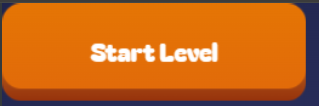

# UIButton Component - Developer Guide

A customizable 3D-style button component for Excalibur.js with hover and press states, gradient backgrounds, and event handling.



## Installation

Ensure you have the required dependencies:

```bash
npm install excalibur canvas-txt
```

## Basic Usage

```typescript
import { UIButton } from "./UIButton";
import { Vector, Color } from "excalibur";

// Create a basic button
const myButton = new UIButton("play-button", new Vector(200, 60), {
  idleText: "Play Game",
  callback: () => console.log("Button clicked!"),
});

// Add to your scene
game.add(myButton);
myButton.pos = new Vector(400, 300);
```

## Configuration Options

### UIButtonOptions

| Property      | Type             | Description                                | Default                  |
| ------------- | ---------------- | ------------------------------------------ | ------------------------ |
| `callback`    | `() => void`     | Function to execute when button is clicked | `() => {}`               |
| `radius`      | `number`         | Corner radius for rounded edges            | `16`                     |
| `idleText`    | `string`         | Text displayed in idle state               | `""`                     |
| `activeText`  | `string`         | Text displayed when pressed                | Same as `idleText`       |
| `hoveredText` | `string`         | Text displayed on hover                    | Same as `idleText`       |
| `textOptions` | `TextOptions`    | Excalibur text styling options             | Default font settings    |
| `colors`      | `UIButtonColors` | Custom color configuration                 | Light/Dark gray gradient |

### UIButtonColors

```typescript
type UIButtonColors = {
  mainStarting: Color; // Top gradient start (idle/pressed)
  mainEnding?: Color; // Top gradient end (idle/pressed)
  bottomStarting: Color; // Bottom shadow start
  bottomEnding?: Color; // Bottom shadow end
  hoverStarting: Color; // Top gradient start (hover)
  hoverEnding?: Color; // Top gradient end (hover)
};
```

## Examples

### Custom Styled Button

```typescript
const styledButton = new UIButton("custom-button", new Vector(250, 80), {
  idleText: "Start",
  hoveredText: "Click Me!",
  activeText: "Starting...",
  textOptions: {
    font: new Font({ size: 24, family: "Impact" }),
    color: Color.White,
  },
  colors: {
    mainStarting: Color.fromHex("#4a90e2"),
    mainEnding: Color.fromHex("#357abd"),
    bottomStarting: Color.fromHex("#2c5a8a"),
    bottomEnding: Color.fromHex("#1e3d5c"),
    hoverStarting: Color.fromHex("#5ba3ff"),
    hoverEnding: Color.fromHex("#4a90e2"),
  },
  callback: () => {
    console.log("Game starting!");
  },
});
```

### Event Handling

```typescript
const button = new UIButton("event-button", new Vector(200, 60), {
  idleText: "Click Me",
});

// Listen to button events
button.emitter.on("UIButtonClicked", evt => {
  console.log(`${evt.name} was clicked!`);
});

button.emitter.on("UIButtonHovered", evt => {
  console.log(`${evt.name} is being hovered!`);
});
```

### Menu System

```typescript
const menuButtons = [
  { name: "new-game", text: "New Game", action: () => startNewGame() },
  { name: "load-game", text: "Load Game", action: () => loadGame() },
  { name: "settings", text: "Settings", action: () => openSettings() },
  { name: "quit", text: "Quit", action: () => quitGame() },
];

menuButtons.forEach((btn, index) => {
  const button = new UIButton(btn.name, new Vector(300, 70), {
    idleText: btn.text,
    callback: btn.action,
    textOptions: {
      font: new Font({ size: 28, family: "Arial" }),
      color: Color.White,
    },
  });

  game.add(button);
  button.pos = new Vector(400, 200 + index * 100);
});
```

## Button States

The button has three visual states:

- **Idle**: Default state when not interacting
- **Hovered**: When mouse cursor is over the button
- **Pressed**: When button is being clicked (with visual offset)

Each state can have different text via `idleText`, `hoveredText`, and `activeText`.

## Visual Features

- **3D Depth Effect**: Button appears raised with a shadow layer
- **Press Animation**: Moves down 6px when clicked
- **Gradient Support**: Both top face and shadow support gradients
- **Hover States**: Different colors when hovering
- **Rounded Corners**: Customizable corner radius

## Technical Details

### Event Timing

- The component includes a 50ms delay after `pointerup` to prevent spurious `pointerleave` events
- Callbacks only trigger if the button is released while the pointer is still over it

### Graphics Bounds

The button uses `pointer.useGraphicsBounds = true` for accurate hit detection.

### Custom Rendering

The button renders to an offscreen canvas for gradient support, then draws to Excalibur's graphics context.

## Dependencies

- **excalibur**: Core game engine
- **canvas-txt**: Text rendering with automatic wrapping and alignment

## License

MIT licensed
