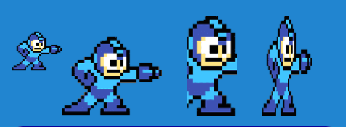

# UIImage Developer Guide

## Overview



The `UIImage` module provides a display component for rendering images in Excalibur UI. It supports multiple image sources, various fit
modes, styling options, and event-driven visibility control.

## Architecture

### Class Hierarchy

```
UIComponent (base)
├── DisplayUIComponent
    └── UIImage
        └── UIImageGraphic (rendering)
```

### Key Components

- **UIImage**: Main component class handling image display and configuration
- **UIImageGraphic**: Rendering implementation with canvas-based drawing
- **ImageFit**: Type defining supported fit modes
- **UIImageEvents**: Type-safe event definitions

## UIImage Class

### Configuration

```typescript
type UIImageConfig = {
  // Basic
  name: string;
  width: number;
  height: number;
  pos: Vector;
  z?: number;

  // Image
  image?: Sprite | ImageSource;
  fit?: ImageFit;

  // Styling
  backgroundColor?: Color;
  borderWidth?: number;
  borderColor?: Color;
  borderRadius?: number;

  // State
  visible?: boolean;
};
```

### Image Sources

UIImage supports two types of image sources:

```typescript
// Excalibur Sprite (recommended for game assets)
const sprite = new Sprite({
  image: myImageSource,
  sourceView: { x: 0, y: 0, width: 64, height: 64 },
});

// Direct ImageSource
const imageSource = new ImageSource("./path/to/image.png");

// Both work with UIImage
const uiImage = new UIImage({
  image: sprite, // or imageSource
  // ... other config
});
```

### Fit Modes

The component supports five image fitting modes:

```typescript
type ImageFit = "contain" | "cover" | "fill" | "scale-down" | "none";
```

#### "contain" (Default)

- Scales image to fit within container while maintaining aspect ratio
- May result in letterboxing/pillarboxing
- Image is never cropped

#### "cover"

- Scales image to cover entire container while maintaining aspect ratio
- May crop parts of the image
- Container is always fully covered

#### "fill"

- Stretches image to exactly fill container
- May distort aspect ratio
- No cropping, but potential distortion

#### "scale-down"

- Same as "contain" but never scales up
- If image is smaller than container, shows at original size
- Maintains aspect ratio

#### "none"

- Shows image at original size, centered
- No scaling applied
- May overflow container if image is larger

### Event System

UIImage emits events for lifecycle changes:

```typescript
type UIImageEvents = {
  UIImageShown: UIImageShown;
  UIImageHidden: UIImageHidden;
  UIImageLoaded: UIImageLoaded;
};
```

### Visibility Control

Images support show/hide/toggle operations with events:

```typescript
// Show image
image.show(); // Emits UIImageShown

// Hide image
image.hide(); // Emits UIImageHidden

// Toggle visibility
image.toggle();

// Check visibility
if (image.isVisible) {
  console.log("Image is visible");
}
```

## UIImageGraphic Rendering

### Rendering Pipeline

1. **Canvas Creation**: Offscreen HTML5 canvas for rendering
2. **Background**: Optional colored background with rounded corners
3. **Image Drawing**: Image rendered with selected fit mode and clipping
4. **Border**: Optional border with rounded corners
5. **Upload**: Final canvas uploaded to Excalibur context

### Key Rendering Methods

```typescript
protected _drawImage(ex: ExcaliburGraphicsContext, x: number, y: number): void {
  // 1. Clear canvas
  // 2. Draw background (if configured)
  // 3. Draw image with fit mode (if loaded)
  // 4. Draw border (if configured)
  // 5. Upload to Excalibur
}
```

### Border Radius Clipping

When `borderRadius` is set, the graphic applies canvas clipping:

```typescript
if (this.config.borderRadius && this.config.borderRadius > 0) {
  ctx.save();
  ctx.beginPath();
  ctx.roundRect(0, 0, width, height, this.config.borderRadius);
  ctx.clip();
  // Draw image
  ctx.restore();
}
```

This ensures images are properly clipped to rounded corners.

## Usage Examples

### Basic Image Display

```typescript
import { UIImage, ImageSource } from "excalibur-ui";

const imageSource = new ImageSource("./assets/logo.png");

const logo = new UIImage({
  name: "logo",
  width: 200,
  height: 150,
  pos: vec(100, 100),
  image: imageSource,
  fit: "contain",
});

engine.add(logo);
```

### Styled Image with Background and Border

```typescript
const styledImage = new UIImage({
  name: "profile",
  width: 120,
  height: 120,
  pos: vec(50, 50),
  image: profileSprite,

  // Styling
  backgroundColor: Color.LightGray,
  borderWidth: 3,
  borderColor: Color.DarkGray,
  borderRadius: 60, // Circular

  // Fit mode
  fit: "cover",
});
```

### Dynamic Image Loading

```typescript
const imageContainer = new UIImage({
  name: "dynamic",
  width: 300,
  height: 200,
  pos: vec(100, 100),
  fit: "contain",
});

// Later, load different images
imageContainer.setImage(newImageSource);
imageContainer.emitter.on("UIImageLoaded", () => {
  console.log("New image loaded!");
});
```

### Image Gallery with Fit Mode Switching

```typescript
class ImageGallery {
  private currentImage: UIImage;
  private fitModes: ImageFit[] = ["contain", "cover", "fill", "scale-down", "none"];
  private currentFitIndex = 0;

  constructor() {
    this.currentImage = new UIImage({
      name: "gallery",
      width: 400,
      height: 300,
      pos: vec(200, 200),
      image: initialImage,
      fit: "contain",
    });
  }

  nextFitMode() {
    this.currentFitIndex = (this.currentFitIndex + 1) % this.fitModes.length;
    this.currentImage.setFit(this.fitModes[this.currentFitIndex]);
  }

  setImage(image: Sprite | ImageSource) {
    this.currentImage.setImage(image);
  }
}
```

### Loading States and Placeholders

```typescript
class ImageLoader {
  private image: UIImage;
  private loadingPlaceholder: UIImage;
  private errorPlaceholder: UIImage;

  constructor() {
    // Main image (initially hidden)
    this.image = new UIImage({
      name: "main",
      width: 300,
      height: 200,
      pos: vec(100, 100),
      visible: false,
    });

    // Loading spinner/placeholder
    this.loadingPlaceholder = new UIImage({
      name: "loading",
      width: 300,
      height: 200,
      pos: vec(100, 100),
      image: loadingSpinner,
      fit: "none",
    });

    // Error placeholder
    this.errorPlaceholder = new UIImage({
      name: "error",
      width: 300,
      height: 200,
      pos: vec(100, 100),
      image: errorIcon,
      fit: "none",
      visible: false,
    });
  }

  async loadImage(url: string) {
    this.loadingPlaceholder.show();
    this.image.hide();
    this.errorPlaceholder.hide();

    try {
      const imageSource = new ImageSource(url);
      await imageSource.load();

      this.image.setImage(imageSource);
      this.loadingPlaceholder.hide();
      this.image.show();
    } catch (error) {
      this.loadingPlaceholder.hide();
      this.errorPlaceholder.show();
    }
  }
}
```

## Extending UIImage

### Custom Image Component

```typescript
class AnimatedUIImage extends UIImage {
  private animationFrame = 0;

  constructor(config: UIImageConfig) {
    super(config);
    // Start animation loop
    this.startAnimation();
  }

  private startAnimation() {
    // Custom animation logic
    setInterval(() => {
      this.animationFrame = (this.animationFrame + 1) % 10;
      // Update image or styling based on frame
    }, 100);
  }

  // Override setImage to reset animation
  setImage(image: Sprite | ImageSource): void {
    super.setImage(image);
    this.animationFrame = 0;
  }
}
```

### Custom Graphic Implementation

```typescript
class CustomImageGraphic extends UIImageGraphic {
  protected _drawImage(ex: ExcaliburGraphicsContext, x: number, y: number): void {
    // Custom rendering - add effects, filters, etc.
    super._drawImage(ex, x, y);

    // Add custom overlay or effects
    // ...
  }
}
```

## Performance Considerations

- **Canvas Rendering**: Images render to offscreen canvas once per frame
- **Image Loading**: Large images may impact performance
- **Fit Mode Complexity**: "cover" and "contain" require calculations
- **Border Radius**: Clipping adds minor performance cost
- **Memory Usage**: Canvas elements consume memory

### Optimization Tips

```typescript
// Use appropriate image sizes
const optimizedImage = new UIImage({
  width: 256, // Power of 2
  height: 256,
  fit: "none", // Avoid scaling calculations
});

// Preload images
await imageSource.load();

// Reuse image sources
const sharedImageSource = new ImageSource("./shared.png");
const image1 = new UIImage({ image: sharedImageSource });
const image2 = new UIImage({ image: sharedImageSource });
```

## Testing

The UIImage component includes comprehensive unit tests covering:

- Configuration validation
- Image source handling (Sprite vs ImageSource)
- All fit modes rendering accuracy
- Visibility state management
- Event emission
- Dynamic property changes
- Canvas rendering output

Run tests with: `npm test`

## Troubleshooting

### Image Not Displaying

```typescript
// Check if image source is loaded
console.log("Image source loaded:", imageSource.isLoaded());

// Check if image is assigned
console.log("Current image:", uiImage.image);

// Check visibility
console.log("Is visible:", uiImage.isVisible);

// Check dimensions
console.log("Size:", uiImage.width, uiImage.height);
```

### Fit Mode Issues

```typescript
// Debug fit calculations
const fit = uiImage.fit;
console.log("Current fit mode:", fit);

// Check container vs image dimensions
console.log("Container:", uiImage.width, uiImage.height);
console.log("Image:", imageSource.width, imageSource.height);
```

### Styling Problems

```typescript
// Check styling properties
console.log("Background:", uiImage._config.backgroundColor);
console.log("Border:", uiImage._config.borderWidth, uiImage._config.borderColor);
console.log("Border radius:", uiImage._config.borderRadius);

// Force redraw
uiImage.graphics.use(new UIImageGraphic(vec(uiImage.width, uiImage.height), uiImage._config));
```

### Event Issues

```typescript
// Listen to all events
uiImage.emitter.on("UIImageShown", () => console.log("Shown"));
uiImage.emitter.on("UIImageHidden", () => console.log("Hidden"));
uiImage.emitter.on("UIImageLoaded", () => console.log("Loaded"));

// Test event emission
uiImage.show();
uiImage.setImage(newImage);
```

## API Reference

### UIImage Properties

- `isVisible: boolean` - Current visibility state
- `image: Sprite | ImageSource | undefined` - Current image source
- `fit: ImageFit | undefined` - Current fit mode
- `eventEmitter: EventEmitter<UIImageEvents>` - Event system access

### UIImage Methods

- `show()` - Make image visible
- `hide()` - Hide image
- `toggle()` - Toggle visibility
- `setImage(image: Sprite | ImageSource)` - Change image source
- `setFit(fit: ImageFit)` - Change fit mode

### Configuration Options

See `UIImageConfig` type definition for complete API.

### Fit Modes

- `"contain"` - Fit image maintaining aspect ratio (may letterbox)
- `"cover"` - Cover container maintaining aspect ratio (may crop)
- `"fill"` - Stretch to fill container (may distort)
- `"scale-down"` - Fit like contain but never scale up
- `"none"` - Original size, centered (may overflow)

## Dependencies

- `excalibur`: Core game engine
- Base UI framework components (`UIComponent`, `DisplayUIComponent`)

## Migration Guide

### From v1.x to v2.x

- Event system updated to use emitters instead of callbacks
- `DisplayUIComponent` base class introduced
- Image loading events now include image reference
- Canvas rendering optimizations added

### Breaking Changes

````typescript
// Old way (v1.x)
const image = new UIImage({
  onShown: () => console.log("shown")
});

// New way (v2.x)
const image = new UIImage({});
image.emitter.on("UIImageShown", () => console.log("shown"));
```</content>
<parameter name="filePath">c:\programming\UIFramework\UIImage-Developer-README.md
````
