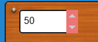

# UINumeric Developer Guide

## Overview



The `UINumeric` module provides a sophisticated numeric input component for Excalibur UI. It supports formatted number display,
keyboard editing, increment/decrement buttons, validation, and comprehensive event handling.

## Architecture

### Class Hierarchy

```
UIComponent (base)
├── InteractiveUIComponent
    ├── UINumeric
    │   ├── UINumericGraphic (rendering)
    │   ├── UINumericArrowButton (up/down buttons)
    │   └── UINumericArrowGraphic (button rendering)
```

### Key Components

- **UINumeric**: Main component class handling numeric input logic
- **UINumericGraphic**: Rendering implementation with text and cursor display
- **UINumericArrowButton**: Child components for increment/decrement buttons
- **UINumericState**: Type defining visual states
- **UINumericEvents**: Type-safe event definitions

## UINumeric Class

### Configuration

```typescript
type UINumericConfig = BaseUIConfig & {
  // Value constraints
  value?: number;
  min?: number;
  max?: number;
  step?: number;

  // Display
  placeholder?: string;
  textOptions?: Omit<TextOptions, "text">;

  // Styling
  colors?: UINumericColors;
  inputRadius?: number;
  padding?: Vector;
  borderWidth?: number;

  // Features
  showArrows?: boolean;
  arrowWidth?: number;
  allowNegative?: boolean;
  allowDecimal?: boolean;
  formatOptions?: UINumericFormatOptions;

  // Navigation
  tabStopIndex?: number;
};
```

### Visual States

The numeric input supports three visual states:

```typescript
type UINumericState = "normal" | "focused" | "disabled";
```

State transitions are managed automatically based on focus and enabled status.

### Number Formatting

The component supports comprehensive number formatting:

```typescript
type UINumericFormatOptions = {
  decimals?: number; // Decimal places (default: 2)
  thousandsSeparator?: string; // Thousands separator (default: ",")
  decimalSeparator?: string; // Decimal separator (default: ".")
  prefix?: string; // Prefix like "$" or "€"
  suffix?: string; // Suffix like "%" or "kg"
  useExponential?: boolean; // Use scientific notation
  exponentialThreshold?: number; // Threshold for exponential notation
};
```

### Value Management

The component provides robust value management with constraints:

```typescript
// Get current value
const value = numeric.getValue();

// Set value (clamped to min/max)
numeric.setValue(42.5);

// Value constraints
numeric.setMin(0);
numeric.setMax(100);
numeric.setStep(0.5);
```

### Text Editing

When focused, the component switches to text editing mode:

```typescript
// Get display text (formatted or editing)
const displayText = numeric.getDisplayText();

// Cursor management
const cursorPos = numeric.getCursorPosition();
numeric.setCursorPosition(5);
```

### Event System

UINumeric emits comprehensive events for all interactions:

```typescript
type UINumericEvents = {
  UINumericValueChanged: UINumericValueChanged;
  UINumericFocused: UINumericFocused;
  UINumericUnfocused: UINumericUnfocused;
  UINumericDisabled: UINumericDisabled;
  UINumericEnabled: UINumericEnabled;
  UINumericSubmit: UINumericSubmit;
  UINumericIncrement: UINumericIncrement;
  UINumericDecrement: UINumericDecrement;
};
```

## UINumericGraphic Rendering

### Rendering Pipeline

1. **Canvas Creation**: Offscreen HTML5 canvas for rendering
2. **Background**: Gradient background with rounded corners and borders
3. **Text Display**: Formatted number or editing text with cursor
4. **Arrow Buttons**: Optional increment/decrement buttons
5. **State-Based Styling**: Colors change based on `UINumericState`

### Key Rendering Methods

```typescript
protected _drawImage(ex: ExcaliburGraphicsContext, x: number, y: number): void {
  // 1. Clear canvas
  // 2. Draw background gradient and border
  // 3. Draw formatted text or editing text
  // 4. Draw blinking cursor when focused
  // 5. Upload to Excalibur context
}
```

### Cursor Rendering

When focused and editing, a blinking cursor is displayed:

```typescript
// Cursor blink logic
if (this.isFocused && this._cursorVisible) {
  const cursorX = this.calculateCursorX();
  ctx.fillStyle = this.colors.cursorColor.toString();
  ctx.fillRect(cursorX, padding.y, 2, this.size.y - padding.y * 2);
}
```

## Arrow Button System

### UINumericArrowButton

The component can display increment/decrement arrow buttons:

```typescript
// Arrow buttons are child ScreenElements
if (this._config.showArrows) {
  const upArrow = new UINumericArrowButton(this, "up", this._config);
  const downArrow = new UINumericArrowButton(this, "down", this._config);
  this.addChild(upArrow);
  this.addChild(downArrow);
}
```

### Arrow Button Interaction

```typescript
// Increment/decrement methods
increment(): void {
  const step = this._config.step ?? 1;
  this.setValue(this._value + step);
  // Emits UINumericIncrement event
}

decrement(): void {
  const step = this._config.step ?? 1;
  this.setValue(this._value - step);
  // Emits UINumericDecrement event
}
```

## Input Validation

### Numeric Input Validation

The component validates keyboard input to ensure only valid numeric characters:

```typescript
private isValidNumericInput(key: string): boolean {
  // Allow digits 0-9
  if (/[0-9]/.test(key)) return true;

  // Allow negative sign at start (if allowed)
  if (key === "-" && this._config.allowNegative &&
      this._cursorPosition === 0 && !currentText.includes("-")) {
    return true;
  }

  // Allow decimal point (if allowed and not present)
  if (key === "." && this._config.allowDecimal &&
      !currentText.includes(".")) {
    return true;
  }

  return false;
}
```

### Value Clamping

All values are clamped to the configured min/max range:

```typescript
private clampValue(value: number): number {
  const min = this._config.min ?? -Infinity;
  const max = this._config.max ?? Infinity;
  return Math.max(min, Math.min(max, value));
}
```

## Usage Examples

### Basic Numeric Input

```typescript
import { UINumeric } from "excalibur-ui";

const numeric = new UINumeric({
  name: "age",
  width: 150,
  height: 40,
  pos: vec(100, 100),
  value: 25,
  min: 0,
  max: 120,
  placeholder: "Enter age",
});

engine.add(numeric);
```

### Currency Input with Formatting

```typescript
const priceInput = new UINumeric({
  name: "price",
  width: 200,
  height: 40,
  pos: vec(50, 50),
  value: 29.99,

  // Formatting
  formatOptions: {
    decimals: 2,
    prefix: "$",
    thousandsSeparator: ",",
    decimalSeparator: ".",
  },

  // Constraints
  min: 0,
  max: 999999.99,
  step: 0.01,

  // Styling
  colors: {
    backgroundStarting: Color.White,
    borderFocused: Color.Green,
    borderNormal: Color.Gray,
  },
});
```

### Integer-Only Input with Arrows

```typescript
const quantityInput = new UINumeric({
  name: "quantity",
  width: 120,
  height: 35,
  pos: vec(200, 100),
  value: 1,

  // Integer only
  allowDecimal: false,
  allowNegative: false,

  // Range and step
  min: 1,
  max: 99,
  step: 1,

  // Show arrows for easy adjustment
  showArrows: true,
  arrowWidth: 25,

  // Formatting
  formatOptions: {
    decimals: 0,
    suffix: " items",
  },
});
```

### Scientific Notation for Large Numbers

```typescript
const scientificInput = new UINumeric({
  name: "largeNumber",
  width: 250,
  height: 40,
  pos: vec(100, 200),
  value: 1234567890,

  // Scientific notation for large numbers
  formatOptions: {
    useExponential: true,
    exponentialThreshold: 1000000, // 1 million
    decimals: 3,
  },

  // Wide range
  min: 0,
  max: Number.MAX_SAFE_INTEGER,
});
```

### Custom Styled Input

```typescript
const customInput = new UINumeric({
  name: "custom",
  width: 180,
  height: 45,
  pos: vec(300, 50),
  value: 42,

  // Custom styling
  colors: {
    backgroundStarting: Color.fromHex("#2C3E50"),
    backgroundEnding: Color.fromHex("#34495E"),
    borderNormal: Color.fromHex("#7F8C8D"),
    borderFocused: Color.fromHex("#3498DB"),
    cursorColor: Color.fromHex("#ECF0F1"),
    arrowButtonBackground: Color.fromHex("#34495E"),
    arrowButtonHover: Color.fromHex("#7F8C8D"),
    arrowColor: Color.fromHex("#BDC3C7"),
  },

  // Rounded corners
  inputRadius: 8,
  borderWidth: 2,

  // Custom font
  textOptions: {
    font: new Font({
      size: 16,
      family: "Arial",
      bold: true,
    }),
    color: Color.fromHex("#ECF0F1"),
  },

  // Navigation
  tabStopIndex: 2,
});
```

### Event Handling

```typescript
// Value changes
numeric.emitter.on("UINumericValueChanged", event => {
  console.log("Value changed to:", event.value);
  updateTotal(event.value);
});

// Focus events
numeric.emitter.on("UINumericFocused", () => {
  console.log("Input focused - ready for editing");
});

numeric.emitter.on("UINumericUnfocused", () => {
  console.log("Input unfocused - value committed");
});

// Submit (Enter key)
numeric.emitter.on("UINumericSubmit", event => {
  console.log("Submitted value:", event.value);
  processValue(event.value);
});

// Arrow button events
numeric.emitter.on("UINumericIncrement", event => {
  console.log("Incremented to:", event.value);
});

numeric.emitter.on("UINumericDecrement", event => {
  console.log("Decremented to:", event.value);
});
```

### Form Integration

```typescript
class NumericForm {
  private inputs: UINumeric[] = [];
  private submitButton: UIButton;

  constructor() {
    // Create form inputs
    this.inputs = [
      new UINumeric({ name: "width", value: 100, min: 1, max: 1000 }),
      new UINumeric({ name: "height", value: 100, min: 1, max: 1000 }),
      new UINumeric({ name: "quantity", value: 1, min: 1, max: 100, allowDecimal: false }),
    ];

    // Submit button
    this.submitButton = new UIButton({
      text: "Create",
      callback: () => this.submit(),
    });

    // Add to engine
    this.inputs.forEach(input => engine.add(input));
    engine.add(this.submitButton);
  }

  private submit() {
    const formData = {
      width: this.inputs[0].getValue(),
      height: this.inputs[1].getValue(),
      quantity: this.inputs[2].getValue(),
    };

    console.log("Form submitted:", formData);
    // Process form data...
  }
}
```

## API Reference

### UINumeric Properties

- `isFocused: boolean` - Current focus state (getter)
- `min: number` - Minimum allowed value (getter)
- `max: number` - Maximum allowed value (getter)
- `step: number` - Increment/decrement step size (getter)
- `eventEmitter: EventEmitter<UINumericEvents>` - Event system access

### UINumeric Methods

- `getValue(): number` - Get current numeric value
- `setValue(value: number)` - Set numeric value (clamped)
- `getDisplayText(): string` - Get text for display
- `getCursorPosition(): number` - Get cursor position
- `setCursorPosition(pos: number)` - Set cursor position
- `focus()` - Give keyboard focus
- `loseFocus()` - Remove keyboard focus
- `increment()` - Increase value by step
- `decrement()` - Decrease value by step
- `setMin(min: number)` - Set minimum value
- `setMax(max: number)` - Set maximum value
- `setStep(step: number)` - Set step size
- `setFormatOptions(options)` - Update formatting options

### Configuration Options

See `UINumericConfig`, `UINumericColors`, and `UINumericFormatOptions` type definitions for complete API.
