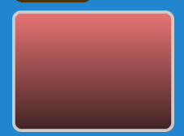

# UIPanel Developer Guide

## Overview



The `UIPanel` module provides three types of display panels for organizing and containing UI elements in Excalibur. All panels are
non-interactive display components that serve as containers for other UI elements.

## Panel Types

### 1. UIPanel - Standard Gradient Panel

A procedurally rendered panel with gradient backgrounds, borders, rounded corners, and optional drop shadows.

### 2. UISpritePanel - Sprite-Based Panel

A panel that uses a pre-rendered sprite as its background, stretched to fit the panel dimensions.

### 3. UINineSlicePanel - Scalable Nine-Slice Panel

A panel that uses Excalibur's NineSlice system for scalable UI elements that preserve corner fidelity while stretching edges and
center.

## Architecture

### Class Hierarchy

```
UIComponent (base)
├── DisplayUIComponent
    ├── UIPanel
    │   └── UIPanelGraphic (rendering)
    ├── UISpritePanel
    │   └── UISpritePanelGraphic (rendering)
    └── UINineSlicePanel
        └── NineSlice (Excalibur built-in)
```

### Key Components

- **UIPanel/UISpritePanel/UINineSlicePanel**: Main panel classes
- **UIPanelGraphic/UISpritePanelGraphic**: Custom rendering implementations
- **NineSlice**: Excalibur's built-in scalable rendering
- **UIPanelEvents**: Shared event system for all panel types

## Children

Since UIPanels are extended ScreenElements in Excalibur, to nest elements within the panels one simply uses the `addChild` API call to
nest elements.

## UIPanel - Standard Panel

### Configuration

```typescript
type UIPanelConfig = BaseUIConfig & {
  // Styling
  colors?: UIPanelColors;
  borderWidth?: number;
  panelRadius?: number;
  padding?: Vector;

  // State
  visible?: boolean;

  // Effects
  shadow?: {
    offsetX: number;
    offsetY: number;
    blur: number;
    color: Color;
  };
};
```

### Color Configuration

```typescript
type UIPanelColors = {
  backgroundStarting: Color; // Top gradient color
  backgroundEnding?: Color; // Bottom gradient color (optional)
  borderColor?: Color; // Border color
};
```

### Rendering Pipeline

1. **Canvas Creation**: Offscreen HTML5 canvas for rendering
2. **Shadow**: Optional drop shadow using CSS shadow properties
3. **Background**: Gradient-filled rounded rectangle
4. **Border**: Inset border using composite operations
5. **Upload**: Final canvas uploaded to Excalibur context

### Border Rendering Technique

The panel uses a sophisticated border rendering technique:

```typescript
// 1. Draw full outer shape with border color
ctx.fillStyle = borderColor;
ctx.roundRect(0, 0, width, height, radius);
ctx.fill();

// 2. Cut out inner area using destination-out
ctx.globalCompositeOperation = "destination-out";
ctx.roundRect(borderWidth, borderWidth, width - borderWidth * 2, height - borderWidth * 2, innerRadius);
ctx.fill();

// 3. Redraw background in the cut-out area
ctx.globalCompositeOperation = "source-over";
this.drawRoundedRect(
  ctx,
  borderWidth,
  borderWidth,
  width - borderWidth * 2,
  height - borderWidth * 2,
  innerRadius,
  backgroundGradient,
);
```

This creates crisp borders that don't bleed outside the panel bounds.

## UISpritePanel - Sprite Panel

### Configuration

```typescript
type UISpritePanelConfig = BaseUIConfig & {
  sprite?: Sprite; // Background sprite
  padding?: Vector; // Content padding
  visible?: boolean; // Initial visibility
};
```

### Rendering

Sprite panels use simple sprite stretching:

```typescript
if (this.sprite) {
  const image = this.sprite.image.image;
  ctx.drawImage(image, 0, 0, this.size.x, this.size.y);
} else {
  // Fallback: simple bordered rectangle
  ctx.fillStyle = "#f0f0f0";
  ctx.fillRect(0, 0, this.size.x, this.size.y);
  ctx.strokeStyle = "#cccccc";
  ctx.strokeRect(1, 1, this.size.x - 2, this.size.y - 2);
}
```

## UINineSlicePanel - Nine-Slice Panel

### Configuration

```typescript
type UINineSlicePanelConfig = BaseUIConfig & {
  sprite: Sprite; // Source sprite for slicing
  sourceConfig: {
    // Slice region definition
    width: number;
    height: number;
    topMargin: number;
    leftMargin: number;
    bottomMargin: number;
    rightMargin: number;
  };
  destinationConfig?: {
    // Stretch behavior
    drawCenter: boolean;
    stretchH: NineSliceStretch;
    stretchV: NineSliceStretch;
  };
  padding?: Vector;
  visible?: boolean;
};
```

### Nine-Slice Concept

Nine-slice scaling divides an image into 9 regions:

- **Corners** (4): Never scaled, preserve aspect
- **Edges** (4): Scaled in one dimension only
- **Center** (1): Scaled in both dimensions

```
+---+---+---+
| 1 | 2 | 3 |
+---+---+---+
| 4 | 5 | 6 |
+---+---+---+
| 7 | 8 | 9 |
+---+---+---+
```

### Stretch Modes

```typescript
enum NineSliceStretch {
  Stretch = "stretch", // Scale to fit
  Tile = "tile", // Repeat pattern
}
```

## Shared Features

### Visibility Control

All panels support show/hide functionality with events:

```typescript
// Show panel
panel.show(); // Emits UIPanelShown

// Hide panel
panel.hide(); // Emits UIPanelHidden

// Toggle visibility
panel.toggle();

// Check visibility
if (panel.isVisible) {
  console.log("Panel is visible");
}
```

### Event System

All panels share the same event types:

```typescript
type UIPanelEvents = {
  UIPanelShown: UIPanelShown;
  UIPanelHidden: UIPanelHidden;
};
```

## API Reference

### Shared Panel Properties

- `isVisible: boolean` - Current visibility state
- `contentArea: {x, y, width, height}` - Inner bounds for content layout
- `eventEmitter: EventEmitter<UIPanelEvents>` - Event system access

### Shared Panel Methods

- `show()` - Make panel visible
- `hide()` - Hide panel
- `toggle()` - Toggle visibility

### UIPanel Specific

- Configuration: `UIPanelConfig`
- Colors: `UIPanelColors`

### UISpritePanel Specific

- Configuration: `UISpritePanelConfig`
- Sprite-based background rendering

### UINineSlicePanel Specific

- Configuration: `UINineSlicePanelConfig`
- Nine-slice scaling with `NineSliceStretch` modes
