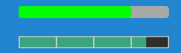

# UIProgress

Progress bar components for the Excalibur UI Framework that display completion status with customizable visual styles and event-driven
updates.



## Progress Bar Types

### Standard Progress Bar (UIProgressBar)

A procedurally rendered progress bar with customizable colors, borders, and rounded corners. Perfect for health bars, loading
indicators, and status displays.

### Sprite Progress Bar (UISpriteProgressBar)

A sprite-based progress bar that uses images for visual representation, allowing for themed or artistic progress indicators.

## Quick Start

```typescript
import { UIProgressBar, Color } from "excalibur-ui";

// Simple progress bar
const progressBar = new UIProgressBar({
  width: 300,
  height: 30,
  pos: vec(100, 100),
  value: 75,
  colors: {
    track: Color.DarkGray,
    fill: Color.Green,
    border: Color.Black,
  },
});

engine.add(progressBar);
```

## Features

- **Dual Rendering Modes**: Procedural colors or sprite-based graphics
- **Orientation Support**: Horizontal and vertical progress bars
- **Value Management**: Min/max ranges with automatic clamping
- **Visual Customization**: Colors, borders, corner radius, percentage text
- **Event System**: Progress change, completion, and state events
- **Disabled State**: Visual feedback for inactive progress bars
- **Performance Optimized**: Canvas-based rendering with efficient updates

## Basic Usage

### Standard Progress Bar

```typescript
const healthBar = new UIProgressBar({
  name: "health",
  width: 200,
  height: 24,
  pos: vec(50, 50),
  min: 0,
  max: 100,
  value: 85,
  orientation: "horizontal",
  trackRadius: 6,
  colors: {
    track: Color.fromHex("#333333"),
    fill: Color.fromHex("#FF4444"),
    border: Color.fromHex("#000000"),
  },
  showPercentage: true,
  percentageTextColor: Color.White,
  percentageTextSize: 12,
});
```

### Vertical Progress Bar

```typescript
const manaBar = new UIProgressBar({
  name: "mana",
  width: 24,
  height: 150,
  pos: vec(400, 100),
  orientation: "vertical",
  value: 60,
  colors: {
    track: Color.fromHex("#1a1a2e"),
    fill: Color.fromHex("#16213e"),
    border: Color.fromHex("#0f3460"),
  },
});
```

### Sprite-Based Progress Bar

```typescript
const spriteProgress = new UISpriteProgressBar({
  name: "experience",
  width: 250,
  height: 20,
  pos: vec(100, 200),
  sprites: {
    track: experienceTrackSprite,
    fill: experienceFillSprite,
    border: experienceBorderSprite,
  },
  showPercentage: true,
});
```

## Value Management

### Setting Values

```typescript
// Direct value assignment (auto-clamped)
progressBar.value = 75;

// Increment/decrement
progressBar.increment(10); // Add 10
progressBar.decrement(5); // Subtract 5

// Set to extremes
progressBar.reset(); // Set to minimum
progressBar.complete(); // Set to maximum
```

### Range Configuration

```typescript
// Set range limits
progressBar.setMin(0);
progressBar.setMax(1000);
progressBar.setRange(0, 500);

// Get current range
const min = progressBar.getMin();
const max = progressBar.getMax();
```

### Reading Values

```typescript
// Current value
const current = progressBar.value;

// Percentage (0.0 to 1.0)
const percent = progressBar.percent;

// Formatted percentage
const percentText = `${Math.round(progressBar.percent * 100)}%`;
```

## Event Handling

Progress bars emit events for various state changes:

```typescript
// Progress value changed
progressBar.emitter.on("UIProgressBarChanged", event => {
  console.log(`Progress: ${event.value} (${Math.round(event.percent * 100)}%)`);
});

// Reached maximum
progressBar.emitter.on("UIProgressBarComplete", event => {
  console.log("Task complete!");
  showCompletionEffect();
});

// Reached minimum
progressBar.emitter.on("UIProgressBarEmpty", event => {
  console.log("Out of resources!");
  showWarningEffect();
});

// Enabled/disabled state changes
progressBar.emitter.on("UIProgressBarEnabled", event => {
  console.log("Progress bar activated");
});

progressBar.emitter.on("UIProgressBarDisabled", event => {
  console.log("Progress bar deactivated");
});
```

## Visual Customization

### Color Configuration

```typescript
const customProgress = new UIProgressBar({
  colors: {
    track: Color.fromHex("#2c3e50"), // Background
    fill: Color.fromHex("#e74c3c"), // Progress fill
    border: Color.fromHex("#34495e"), // Border
    disabled: Color.fromHex("#95a5a6"), // Disabled appearance
  },
});
```

### Styling Options

```typescript
const styledBar = new UIProgressBar({
  trackRadius: 12, // Rounded corners
  showPercentage: true, // Show percentage text
  percentageTextColor: Color.Yellow, // Text color
  percentageTextSize: 14, // Text size
});
```

### Sprite Configuration

```typescript
const spriteBar = new UISpriteProgressBar({
  sprites: {
    track: backgroundSprite, // Background layer
    fill: fillSprite, // Progress indicator
    border: overlaySprite, // Foreground overlay
  },
});
```

## Advanced Examples

### Health Bar with Dynamic Colors

```typescript
class HealthBar {
  private progressBar: UIProgressBar;

  constructor() {
    this.progressBar = new UIProgressBar({
      width: 200,
      height: 24,
      pos: vec(50, 50),
      min: 0,
      max: 100,
      value: 100,
      colors: this.getHealthColors(100),
    });

    // Update colors based on health percentage
    this.progressBar.emitter.on("UIProgressBarChanged", event => {
      this.progressBar.graphics.current[0].config.colors = this.getHealthColors(event.percent);
    });
  }

  private getHealthColors(percent: number): any {
    if (percent > 0.6) {
      return { track: Color.DarkGray, fill: Color.Green };
    } else if (percent > 0.3) {
      return { track: Color.DarkGray, fill: Color.Yellow };
    } else {
      return { track: Color.DarkGray, fill: Color.Red };
    }
  }

  setHealth(health: number) {
    this.progressBar.value = health;
  }
}
```

### Loading Progress with Animation

```typescript
class LoadingProgress {
  private progressBar: UIProgressBar;
  private targetValue = 0;
  private currentValue = 0;

  constructor() {
    this.progressBar = new UIProgressBar({
      width: 300,
      height: 20,
      pos: vec(250, 300),
      colors: {
        track: Color.fromHex("#e0e0e0"),
        fill: Color.fromHex("#2196F3"),
      },
      showPercentage: true,
      percentageTextColor: Color.White,
    });
  }

  // Smooth progress animation
  setProgress(target: number) {
    this.targetValue = target;
    this.animateToTarget();
  }

  private animateToTarget() {
    const diff = this.targetValue - this.currentValue;
    if (Math.abs(diff) < 0.1) {
      this.progressBar.value = this.targetValue;
      this.currentValue = this.targetValue;
      return;
    }

    this.currentValue += diff * 0.1; // Smooth interpolation
    this.progressBar.value = this.currentValue;

    requestAnimationFrame(() => this.animateToTarget());
  }

  show() {
    engine.add(this.progressBar);
  }

  hide() {
    engine.remove(this.progressBar);
  }
}
```

### Multi-Segment Progress Bar

```typescript
class MultiSegmentProgress {
  private segments: UIProgressBar[] = [];
  private totalValue = 0;

  constructor(segmentCount: number, totalWidth: number) {
    const segmentWidth = totalWidth / segmentCount;

    for (let i = 0; i < segmentCount; i++) {
      const segment = new UIProgressBar({
        width: segmentWidth - 2, // Small gap between segments
        height: 20,
        pos: vec(100 + i * segmentWidth, 200),
        min: 0,
        max: 100 / segmentCount,
        value: 0,
        colors: {
          track: Color.fromHex("#333333"),
          fill: Color.fromHex("#4CAF50"),
        },
      });

      this.segments.push(segment);
    }
  }

  setTotalProgress(percent: number) {
    const totalSegments = this.segments.length;
    const fullSegments = Math.floor(percent * totalSegments);
    const partialSegment = (percent * totalSegments) % 1;

    this.segments.forEach((segment, index) => {
      if (index < fullSegments) {
        segment.value = segment.max; // Full
      } else if (index === fullSegments) {
        segment.value = partialSegment * segment.max; // Partial
      } else {
        segment.value = 0; // Empty
      }
    });
  }

  show() {
    this.segments.forEach(segment => engine.add(segment));
  }

  hide() {
    this.segments.forEach(segment => engine.remove(segment));
  }
}
```

### Experience Bar with Level Up

```typescript
class ExperienceBar {
  private progressBar: UIProgressBar;
  private currentLevel = 1;
  private experience = 0;
  private experienceToNext = 100;

  constructor() {
    this.progressBar = new UIProgressBar({
      width: 400,
      height: 25,
      pos: vec(200, 500),
      min: 0,
      max: 100,
      value: 0,
      colors: {
        track: Color.fromHex("#2c3e50"),
        fill: Color.fromHex("#f39c12"),
        border: Color.fromHex("#34495e"),
      },
      showPercentage: true,
      percentageTextColor: Color.White,
    });

    this.progressBar.emitter.on("UIProgressBarComplete", () => {
      this.levelUp();
    });
  }

  addExperience(amount: number) {
    this.experience += amount;

    while (this.experience >= this.experienceToNext) {
      this.experience -= this.experienceToNext;
      this.levelUp();
    }

    this.updateProgress();
  }

  private levelUp() {
    this.currentLevel++;
    this.experienceToNext = Math.floor(this.experienceToNext * 1.2); // Exponential scaling
    this.experience = 0;

    // Visual level up effect
    this.showLevelUpEffect();

    // Reset progress bar for new level
    this.progressBar.value = 0;
  }

  private updateProgress() {
    const progress = (this.experience / this.experienceToNext) * 100;
    this.progressBar.value = progress;
  }

  private showLevelUpEffect() {
    // Add particle effects, sounds, etc.
    console.log(`Level ${this.currentLevel} reached!`);
  }
}
```

## Configuration Reference

### Common Properties

- `width`, `height`: Dimensions
- `pos`: Position vector
- `min`, `max`: Value range (default: 0-100)
- `value`: Current progress value
- `orientation`: "horizontal" or "vertical"
- `showPercentage`: Display percentage text
- `percentageTextColor`: Text color
- `percentageTextSize`: Text font size

### UIProgressBar Specific

- `trackRadius`: Corner radius for rounded bars
- `colors`: Color configuration object

### UISpriteProgressBar Specific

- `sprites`: Sprite configuration object with track/fill/border

## API Reference

### Properties

- `value: number` - Current progress value
- `percent: number` - Progress as decimal (0.0-1.0)
- `eventEmitter: EventEmitter` - Event system access

### Methods

- `increment(amount?: number)` - Increase progress
- `decrement(amount?: number)` - Decrease progress
- `reset()` - Set to minimum value
- `complete()` - Set to maximum value
- `setMin(min: number)` - Set minimum value
- `setMax(max: number)` - Set maximum value
- `setRange(min: number, max: number)` - Set value range
- `getMin(): number` - Get minimum value
- `getMax(): number` - Get maximum value

### Events

- `UIProgressBarChanged` - Value changed
- `UIProgressBarComplete` - Reached maximum
- `UIProgressBarEmpty` - Reached minimum
- `UIProgressBarEnabled` - Component enabled
- `UIProgressBarDisabled` - Component disabled
