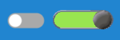

# UISwitch



Toggle switch components for the Excalibur UI Framework that provide on/off functionality with customizable visual styles and
comprehensive event handling.

## Switch Types

### Standard Switch (UISwitch)

A procedurally rendered toggle switch with customizable colors, track radius, and knob styling. Perfect for settings panels and
configuration options.

### Sprite Switch (UISpriteSwitch)

A sprite-based toggle switch that uses images for visual representation, allowing for themed or artistic switch controls.

## Quick Start

```typescript
import { UISwitch, Color } from "excalibur-ui";

// Create a settings switch
const soundSwitch = new UISwitch({
  name: "soundEnabled",
  width: 50,
  height: 24,
  pos: vec(100, 100),
  checked: true, // Start in "on" state
  colors: {
    trackOff: Color.DarkGray,
    trackOn: Color.Green,
    knob: Color.White,
  },
});

engine.add(soundSwitch);

// Listen for state changes
soundSwitch.emitter.on("UISwitchChanged", event => {
  console.log(`Sound ${event.target.checked ? "enabled" : "disabled"}`);
  setSoundEnabled(event.target.checked);
});
```

## Features

- **Dual Rendering Modes**: Procedural colors or sprite-based graphics
- **Toggle Functionality**: Clean on/off state management
- **Multiple Input Methods**: Mouse/touch clicks and keyboard navigation
- **Focus Management**: Visual focus indicators and keyboard accessibility
- **Hover States**: Visual feedback for mouse interaction
- **Event System**: Comprehensive events for all interactions
- **Accessibility**: Tab navigation and keyboard support
- **Performance Optimized**: Efficient canvas-based rendering

## Basic Usage

### Standard Switch

```typescript
const wifiSwitch = new UISwitch({
  name: "wifiToggle",
  width: 50,
  height: 24,
  pos: vec(50, 50),
  checked: false,
  trackRadius: 12, // Rounded track
  knobRadius: 10, // Knob size
  colors: {
    trackOff: Color.fromHex("#666666"),
    trackOn: Color.fromHex("#2196F3"),
    knob: Color.White,
    disabled: Color.Gray,
  },
  focusIndicator: vec(5, 5), // Focus dot position
});
```

### Sprite-Based Switch

```typescript
const customSwitch = new UISpriteSwitch({
  name: "powerSwitch",
  width: 60,
  height: 30,
  pos: vec(200, 100),
  checked: false,
  sprites: {
    trackOff: trackOffSprite,
    trackOn: trackOnSprite,
    knobOff: knobOffSprite,
    knobOn: knobOnSprite,
  },
});
```

## State Management

### Setting Switch State

```typescript
// Direct state assignment
switch.checked = true;   // Turn on
switch.checked = false;  // Turn off

// Toggle current state
switch.toggle();

// Check current state
if (switch.checked) {
  console.log("Switch is ON");
} else {
  console.log("Switch is OFF");
}
```

### Programmatic Control

```typescript
// Initialize multiple switches
const switches = [
  { name: "music", checked: true },
  { name: "sound", checked: false },
  { name: "notifications", checked: true }
].map(config => new UISwitch({
  ...config,
  pos: vec(50, 50 + switches.length * 40)
}));

// Bulk operations
function enableAll() {
  switches.forEach(switch => switch.checked = true);
}

function disableAll() {
  switches.forEach(switch => switch.checked = false);
}

function toggleAll() {
  switches.forEach(switch => switch.toggle());
}
```

## Input Handling

### Mouse/Touch Interaction

Switches automatically handle pointer events:

- **Click**: Toggles the switch state
- **Hover**: Visual feedback (if implemented)
- **Focus**: Automatic focus on interaction

```typescript
// Listen to interaction events
switch.emitter.on("UISwitchDown", (event) => {
  console.log("Switch pressed");
});

switch.emitter.on("UISwitchUp", (event) => {
  console.log("Switch released");
});
```

### Keyboard Navigation

When focused, switches support keyboard interaction:

- **Space or Enter**: Toggle state
- **Tab**: Navigate between focusable elements

```typescript
// Focus management
switch.focus();      // Give keyboard focus
switch.loseFocus();  // Remove keyboard focus

// Check focus state
if (switch.isFocused) {
  console.log("Switch has keyboard focus");
}
```

## Event Handling

### State Change Events

```typescript
switch.emitter.on("UISwitchChanged", (event) => {
  console.log("Switch toggled:");
  console.log("  New state:", event.target.checked);
  console.log("  Switch name:", event.target.name);

  // Apply the change
  updateSetting(event.target.name, event.target.checked);
});
```

### Focus Events

```typescript
switch.emitter.on("UISwitchFocused", (event) => {
  console.log("Switch gained focus");
  // Show focus styling or help text
});

switch.emitter.on("UISwitchUnfocused", (event) => {
  console.log("Switch lost focus");
  // Hide focus styling
});
```

### Interaction Events

```typescript
switch.emitter.on("UISwitchHovered", (event) => {
  console.log("Mouse entered switch area");
  // Show tooltip or highlight
});

switch.emitter.on("UISwitchUnhovered", (event) => {
  console.log("Mouse left switch area");
  // Hide tooltip or highlight
});
```

### State Events

```typescript
switch.emitter.on("UISwitchEnabled", (event) => {
  console.log("Switch is now enabled");
});

switch.emitter.on("UISwitchDisabled", (event) => {
  console.log("Switch is now disabled");
});
```

## Advanced Examples

### Settings Panel with Multiple Switches

```typescript
class SettingsPanel {
  private switches: Map<string, UISwitch> = new Map();

  constructor() {
    const settings = [
      { key: "music", label: "Background Music", default: true },
      { key: "sound", label: "Sound Effects", default: true },
      { key: "notifications", label: "Notifications", default: false },
      { key: "vibration", label: "Vibration", default: true },
    ];

    settings.forEach((setting, index) => {
      const switchControl = new UISwitch({
        name: setting.key,
        width: 50,
        height: 24,
        pos: vec(200, 50 + index * 40),
        checked: setting.default,
        colors: {
          trackOff: Color.DarkGray,
          trackOn: Color.Green,
          knob: Color.White,
        },
      });

      // Add label (assuming you have a label component)
      const label = new UILabel({
        text: setting.label,
        pos: vec(50, 50 + index * 40 + 5),
      });

      this.switches.set(setting.key, switchControl);

      // Listen to changes
      switchControl.emitter.on("UISwitchChanged", event => {
        this.onSettingChanged(setting.key, event.target.checked);
      });

      engine.add(switchControl);
      engine.add(label);
    });
  }

  private onSettingChanged(key: string, value: boolean) {
    console.log(`Setting ${key} changed to: ${value}`);

    // Apply setting changes
    switch (key) {
      case "music":
        audioEngine.setMusicEnabled(value);
        break;
      case "sound":
        audioEngine.setSoundEnabled(value);
        break;
      case "notifications":
        notificationSystem.setEnabled(value);
        break;
      case "vibration":
        vibrationSystem.setEnabled(value);
        break;
    }

    // Save settings
    this.saveSettings();
  }

  private saveSettings() {
    const settings = {};
    this.switches.forEach((switchControl, key) => {
      settings[key] = switchControl.checked;
    });
    localStorage.setItem("gameSettings", JSON.stringify(settings));
  }

  loadSettings() {
    const saved = localStorage.getItem("gameSettings");
    if (saved) {
      const settings = JSON.parse(saved);
      this.switches.forEach((switchControl, key) => {
        if (settings[key] !== undefined) {
          switchControl.checked = settings[key];
        }
      });
    }
  }
}
```

### Switch with Confirmation Dialog

```typescript
class ConfirmSwitch {
  private switch: UISwitch;
  private pendingValue: boolean | null = null;

  constructor() {
    this.switch = new UISwitch({
      name: "dangerousSetting",
      width: 50,
      height: 24,
      pos: vec(100, 100),
      checked: false,
      colors: {
        trackOff: Color.DarkGray,
        trackOn: Color.Red, // Red for dangerous action
        knob: Color.White,
      },
    });

    this.switch.emitter.on("UISwitchChanged", event => {
      this.handleSwitchChange(event.target.checked);
    });
  }

  private handleSwitchChange(newValue: boolean) {
    if (newValue) {
      // Dangerous action - show confirmation
      this.showConfirmationDialog();
    } else {
      // Safe action - allow immediately
      this.applySetting(false);
    }
  }

  private showConfirmationDialog() {
    // Show confirmation dialog
    const confirmed = confirm("This action cannot be undone. Continue?");

    if (confirmed) {
      this.applySetting(true);
    } else {
      // Revert the switch
      this.switch.checked = false;
    }
  }

  private applySetting(value: boolean) {
    console.log(`Dangerous setting ${value ? "enabled" : "disabled"}`);
    // Apply the dangerous setting
  }
}
```

### Animated Switch Transitions

```typescript
class AnimatedSwitch extends UISwitch {
  private animationProgress = 0;
  private isAnimating = false;
  private targetChecked = false;

  constructor(config: Partial<UISwitchConfig>) {
    super(config);
  }

  // Override the checked setter to add animation
  set checked(v: boolean) {
    if (v === this._checked) return;

    this.targetChecked = v;
    if (!this.isAnimating) {
      this.startAnimation();
    }
  }

  private startAnimation() {
    this.isAnimating = true;
    this.animationProgress = 0;

    const animate = () => {
      this.animationProgress += 0.1;

      if (this.animationProgress >= 1) {
        this.animationProgress = 1;
        this.isAnimating = false;
        super.checked = this.targetChecked;
      } else {
        // Smooth interpolation for visual feedback
        const current = this.animationProgress;
        // You could implement custom animation logic here
        requestAnimationFrame(animate);
      }
    };

    requestAnimationFrame(animate);
  }
}
```

### Switch Group with Mutual Dependencies

```typescript
class SwitchGroup {
  private switches: UISwitch[] = [];
  private mutuallyExclusive = false;

  constructor(mutuallyExclusive = false) {
    this.mutuallyExclusive = mutuallyExclusive;
  }

  addSwitch(switchControl: UISwitch) {
    this.switches.push(switchControl);

    if (this.mutuallyExclusive) {
      switchControl.emitter.on("UISwitchChanged", (event) => {
        if (event.target.checked) {
          // Turn off all other switches
          this.switches.forEach(otherSwitch => {
            if (otherSwitch !== event.target) {
              otherSwitch.checked = false;
            }
          });
        }
      });
    }
  }

  // Get all checked switches
  getCheckedSwitches(): UISwitch[] {
    return this.switches.filter(switch => switch.checked);
  }

  // Check if any switch is checked
  hasAnyChecked(): boolean {
    return this.switches.some(switch => switch.checked);
  }

  // Toggle all switches
  setAll(checked: boolean) {
    this.switches.forEach(switch => switch.checked = checked);
  }
}

// Usage
const modeGroup = new SwitchGroup(true); // Only one can be active
modeGroup.addSwitch(easyModeSwitch);
modeGroup.addSwitch(normalModeSwitch);
modeGroup.addSwitch(hardModeSwitch);
```

### Switch with Custom Styling Based on State

```typescript
class SmartSwitch extends UISwitch {
  constructor(config: Partial<UISwitchConfig>) {
    super(config);

    // Update styling when state changes
    this.emitter.on("UISwitchChanged", () => {
      this.updateStyling();
    });

    this.updateStyling(); // Initial styling
  }

  private updateStyling() {
    if (this.checked) {
      // Active styling
      this.colors = {
        trackOn: Color.fromHex("#4CAF50"),
        knob: Color.White,
      };
    } else {
      // Inactive styling
      this.colors = {
        trackOff: Color.fromHex("#757575"),
        knob: Color.fromHex("#BDBDBD"),
      };
    }

    // Force re-render
    this.graphics.current[0]._drawImage(ex, 0, 0);
  }
}
```

## Configuration Reference

### Common Properties

- `width`, `height`: Switch dimensions
- `pos`: Position vector
- `checked`: Initial on/off state
- `focusIndicator`: Position of focus dot
- `tabStopIndex`: Keyboard navigation order

### UISwitch Specific

- `trackRadius`: Corner radius for track
- `knobRadius`: Radius of the toggle knob
- `colors`: Color configuration object

### UISpriteSwitch Specific

- `sprites`: Sprite configuration object with track and knob sprites

## Visual Customization

### Color Themes

```typescript
// iOS-style switch
const iOSTheme = {
  trackOff: Color.fromHex("#E5E5EA"),
  trackOn: Color.fromHex("#34C759"),
  knob: Color.White,
};

// Material Design switch
const materialTheme = {
  trackOff: Color.fromHex("#BDBDBD"),
  trackOn: Color.fromHex("#2196F3"),
  knob: Color.White,
};

// Dark theme
const darkTheme = {
  trackOff: Color.fromHex("#424242"),
  trackOn: Color.fromHex("#FFC107"),
  knob: Color.fromHex("#212121"),
};
```

### Sprite Configuration

```typescript
const customSprites = {
  trackOff: new Sprite({ image: trackOffImage, destSize: { width: 50, height: 24 } }),
  trackOn: new Sprite({ image: trackOnImage, destSize: { width: 50, height: 24 } }),
  knobOff: new Sprite({ image: knobImage, destSize: { width: 20, height: 20 } }),
  knobOn: new Sprite({ image: knobImage, destSize: { width: 20, height: 20 } }),
};
```

## API Reference

### Properties

- `checked: boolean` - Current on/off state
- `isFocused: boolean` - Focus state
- `isHovered: boolean` - Hover state
- `eventEmitter: EventEmitter` - Event system access

### Methods

- `toggle()` - Toggle the current state
- `focus()` - Give keyboard focus
- `loseFocus()` - Remove keyboard focus
- `setEnabled(enabled: boolean)` - Enable/disable the switch

### Events

- `UISwitchChanged` - State changed (on/off)
- `UISwitchFocused` - Gained focus
- `UISwitchUnfocused` - Lost focus
- `UISwitchEnabled` - Component enabled
- `UISwitchDisabled` - Component disabled
- `UISwitchDown` - Pointer pressed
- `UISwitchUp` - Pointer released
- `UISwitchHovered` - Mouse entered
- `UISwitchUnhovered` - Mouse left
